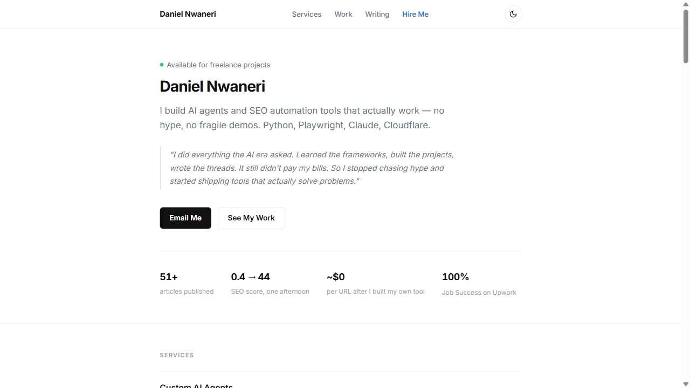

# seo-agent

A local SEO co-pilot built with Python, Browser Use, and the Claude API. Visits real pages in a visible browser window, extracts SEO signals, checks for broken links, scores backlinks, surfaces GSC quick wins, maps internal link clusters, and writes structured reports — resumable if interrupted.



Ran it on my own sites. Found a title cannibalising its own homepage, a position 9.5 query with 0% CTR, two missing internal links, and an orphan page with no path to it.

Everything is open source.

---

## Table of Contents

- [What It Does](#what-it-does)
- [Stack](#stack)
- [Installation](#installation)
- [Configuration](#configuration)
- [Usage](#usage)
- [Modules](#modules)
- [Output](#output)
- [PASS/FAIL Rules](#passfail-rules)
- [Cost](#cost)
- [Scheduling](#scheduling)
- [Attestation Verification](#attestation-verification-optional)
- [Environment Variables](#environment-variables)
- [Architecture](#architecture)
- [Contributing](#contributing)
- [Writing](#writing)
- [License](#license)
- [Limitations](#limitations)

---

## What It Does

**Core audit** (runs on a URL list):

- Visits each URL in a real Chromium browser — not a headless scraper
- Extracts title, meta description, H1s, and canonical tag via Claude API
- Checks for broken same-domain links asynchronously using httpx
- Detects edge cases (404s, login walls, redirects) and pauses for human input
- Writes results to `report.json` incrementally — safe to interrupt and resume
- Generates a plain-English `report-summary.txt` on completion

**Standalone modules** (run independently on any data):

- `qualify-backlinks` — score a list of referring domains for niche relevance and traffic quality
- `gsc-insights` — parse a Search Console export and find quick wins and cannibalisation
- `relevance-score` — score candidate pages as internal link sources for a target URL
- `cluster-audit` — map your full site into topic clusters, find orphans and missing hubs
- `serp-features` — query SerpApi for each target query and detect which SERP features are present (AI Overview, featured snippet, PAA, image pack, video results, local pack, knowledge panel)
- `llm-visibility` — query Claude with your target queries and check whether your domain appears in the responses

---

## Stack

- [Browser Use](https://github.com/browser-use/browser-use) — real browser navigation via Playwright
- [Anthropic Claude API](https://console.anthropic.com) — structured SEO signal extraction (Haiku for modules, Sonnet for core)
- [SerpApi](https://serpapi.com) — structured SERP data for feature detection (free tier: 100 searches/month)
- [httpx](https://www.python-httpx.org/) — async broken link detection and SerpApi calls
- Python 3.11+, flat JSON state files, no database required

---

## Installation

```bash
git clone https://github.com/dannwaneri/seo-agent
cd seo-agent
pip install -r requirements.txt
playwright install chromium
```

---

## Configuration

Set your Anthropic API key:

```bash
# macOS/Linux
export ANTHROPIC_API_KEY="sk-ant-..."

# Windows PowerShell
$env:ANTHROPIC_API_KEY = "sk-ant-..."
```

Or add it to a `.env` file in the project root — the agent loads it automatically:

```
ANTHROPIC_API_KEY=sk-ant-...
```

Add your URLs to `input.csv`:

```
url
https://example.com
https://example.com/about
https://example.com/contact
```

---

## Usage

### Core audit

Interactive mode — pauses on edge cases (login walls, 404s):

```bash
python main.py
```

Auto mode — skips edge cases, logs them to `needs_human[]` in state, continues:

```bash
python main.py --auto
```

Resume after interruption — already-audited URLs are skipped automatically:

```bash
python main.py --auto
# Starting audit: 4 pending, 3 already done.
```

With project isolation (each client gets separate input, state, and reports):

```bash
python main.py --project acme --auto
python main.py --project globex --auto
```

With cost-curve tiered routing (cheaper checks first):

```bash
python main.py --tiered --auto
```

With AI rewrite suggestions:

```bash
python main.py --rewrite --auto
python main.py --rewrite --voice-sample my-writing-sample.txt --auto
```

With viewport screenshots (saves one PNG per URL to `screenshots/`):

```bash
python main.py --tiered --screenshot
# screenshots/dannwaneri-com.png
# screenshots/dannwaneri-com-ai-agents.png
```

### Standalone modules

**Backlink qualifier** — score a `.txt` or `.csv` list of referring domain URLs:

```bash
python main.py qualify-backlinks backlinks.txt --niche "AI agents python"
python main.py qualify-backlinks backlinks.txt --niche "SEO tools" --project acme
```

**GSC insights** — parse a Search Console query export:

```bash
python main.py gsc-insights gsc-export.csv
python main.py gsc-insights gsc-export.csv --min-impressions 100 --project acme
```

**Relevance scorer** — score candidate pages as internal link sources:

```bash
python main.py relevance-score --target https://example.com/target-page --pages pages.txt
python main.py relevance-score --target https://example.com/target --pages pages.txt --project acme
```

**Cluster audit** — map site pages into topic clusters:

```bash
python main.py cluster-audit --pages pages.txt
python main.py cluster-audit --pages pages.txt --project acme
```

**SERP feature detection** — detect which SERP features are present for your target queries (via SerpApi):

```bash
# single query
python main.py serp-features --query "does twitch pay nigerians" --project naija-payments

# from a GSC export (checks top 20 queries by impressions)
python main.py serp-features --queries gsc-export.csv --project naija-payments

# plain text file, one query per line
python main.py serp-features --queries queries.txt --max 10 --project acme
```

Requires a SerpApi key (free tier: 100 searches/month, no credit card):

```bash
export SERPAPI_KEY="your-key-here"
```

Outputs `serp-features.md` — a feature matrix table and per-query opportunity notes.

**LLM visibility checker** — check whether Claude cites your domain when answering your target queries:

```bash
# against a plain text file of queries
python main.py llm-visibility --domain dannwaneri.com --queries queries.txt --project dannwaneri-com

# against a GSC export (checks top 20 queries by impressions)
python main.py llm-visibility --domain naija-vpn.com --queries gsc-export.csv --project naija-payments
```

Outputs `llm-visibility.md` — a visibility score, per-query results, and improvement notes.

> **Limitations:** Claude has a training data cutoff. Content published after that cutoff will not appear regardless of quality — this is a baseline measurement, not a real-time ranking. Re-run quarterly. A score of 0% on a new site is expected; it reflects historical data availability, not content quality.

---

## Modules

All modules use Claude Haiku. Prompts are in `prompts/`. Results write to markdown files in the project directory or repo root.

### Backlink Qualifier

Scores each referring domain on three axes:

| Signal | Weight | What it measures |
|--------|--------|-----------------|
| Niche relevance | 50% | Topical alignment with your target niche (0–100) |
| Traffic quality | 30% | Estimated real traffic vs. spam traffic (0–100) |
| Spam score | 20% (inverted) | Link farm signals, thin content, private blog network patterns (0–100) |

**Composite score** = `niche * 0.50 + traffic * 0.30 - spam * 0.20`

Tiers: Insert Worthy (≥80), Useful (60–79), Neutral (40–59), Borderline (20–39), Avoid (<20 or spam >70).

Fetches pages via real browser. Caches results to flat JSON — crash at URL 47, restart at URL 48.

### GSC Insights

Parses a Search Console query export CSV. Flags quick wins: position 4–20, impressions ≥50 (configurable), CTR <5%. Sends the top 50 rows to Haiku with a prompt that specifically asks for queries where two pages compete — the cannibalisation signal you can't see by sorting a spreadsheet.

### Relevance Scorer

Scores candidate pages as sources for internal links pointing at a target URL:

| Signal | Weight | What it measures |
|--------|--------|-----------------|
| Topical alignment | 40% | How closely the source page's topic matches the target |
| Anchor opportunity | 35% | Whether the source page naturally mentions the target's topic |
| Link equity | 25% | Estimated page strength as a link source |

Checks existing links deterministically before scoring — never recommends a link that already exists.

Tiers: Strong Link (≥75), Good Opportunity (55–74), Possible (35–54), Skip (<35).

### Cluster Audit

Builds the full internal link graph from a page list. Counts incoming links per page — zero incoming means orphan. Sends the complete graph to Haiku: cluster mapping, missing hub detection, cross-cluster link suggestions, and a prioritised fix list.

### SERP Feature Detector

Calls SerpApi for each query and detects seven feature types from the structured JSON response — no browser, no CAPTCHA, no bot detection:

| Feature | What it means for you |
|---------|----------------------|
| AI Overview | Google is summarising this topic — open with a direct 40–60 word answer; use structured headings |
| Featured snippet | Optimise for answer-box format — direct answer in first paragraph |
| People Also Ask | Add an FAQ section using the exact PAA question wording as `<h3>` headings |
| Image pack | Add optimised images with keyword-matching alt text and file names |
| Video results | A short explainer video could rank in this slot |
| Local pack | Organic intent is local; consider whether this query is worth targeting |
| Knowledge panel | Entity query — structured data and authoritative content help |

Results write to `serp-features.md` with a feature matrix and per-query opportunities.

Requires a free SerpApi account ([serpapi.com](https://serpapi.com)) — 100 searches/month free, no credit card. Set `SERPAPI_KEY` in your environment before running.

### LLM Visibility Checker

Queries Claude Haiku with each of your target queries and checks whether your domain appears in the response. Tells you where your content has enough presence in Claude's training data to be cited organically.

Results write to `llm-visibility.md` with a visibility score (cited / total queries), per-query context excerpts, and a list of gaps to address.

**Limitations:** Claude has a training data cutoff. Content published after that cutoff will not appear regardless of quality — a score of 0% on a new domain is expected and reflects data availability, not content quality. Re-run this quarterly to track progress as training data updates. This module does not test Perplexity, ChatGPT, or other LLMs — only Claude.

---

## Output

**`report.json`** — structured audit result per URL:

```json
{
  "url": "https://example.com",
  "title": { "value": "Example", "length": 7, "status": "PASS" },
  "description": { "value": null, "length": 0, "status": "FAIL" },
  "h1": { "count": 1, "value": "Welcome", "status": "PASS" },
  "canonical": { "value": "https://example.com", "status": "PASS" },
  "broken_links": { "count": 0, "status": "PASS" },
  "flags": ["Meta description is missing"]
}
```

**`report-summary.txt`** — plain-English summary:

```
https://example.com          | FAIL [description]
https://example.com/about    | PASS
https://example.com/contact  | FAIL [title, canonical]

1/3 URLs passed
```

Module outputs write to markdown files: `backlink-report.md`, `gsc-insights-report.md`, `relevance-report.md`, `cluster-report.md`.

---

## PASS/FAIL Rules

| Field | FAIL condition |
|-------|----------------|
| Title | Missing or longer than 60 characters |
| Description | Missing or longer than 160 characters |
| H1 | Missing (count = 0) or multiple (count > 1) |
| Canonical | Missing |
| Broken links | Any same-domain link returning non-200 status |

The 60-character title limit is a display threshold, not a ranking penalty. Titles over 60 characters get truncated in Google search results. The agent flags display risk, not a ranking violation.

---

## Cost

The default audit routes every URL through Claude Sonnet. `--tiered` routes cheaper checks first.

| Tier | What runs | Approximate cost per URL |
|------|-----------|--------------------------|
| Tier 1 | Deterministic Python checks (title length, H1 count, link parsing) | $0 |
| Tier 2 | Claude Haiku — meta description suggestion | ~$0.0001 |
| Tier 3 | Claude Sonnet — full extraction + opening paragraph rewrite | ~$0.006 |

Without `--tiered`, every URL uses Tier 3. With `--tiered`, Tier 1 runs first and escalates only when needed. A 20-URL audit at Tier 3 costs about $0.12.

Module runs (backlink qualifier, GSC insights, etc.) all use Haiku — cost is negligible for typical site sizes.

---

## Scheduling

For weekly audits, schedule a batch file or cron job.

**Windows (`run-audit.bat`):**

```batch
@echo off
set ANTHROPIC_API_KEY=your-key-here
cd /d C:\path\to\seo-agent
python main.py --auto
```

**macOS/Linux (cron):**

```bash
# Every Monday at 7am
0 7 * * 1 cd /path/to/seo-agent && ANTHROPIC_API_KEY=your-key python main.py --auto
```

---

## Attestation Verification (Optional)

seo-agent ships with opt-in instrumentation that cross-checks each Claude API call against Anthropic's billing-side usage records — independent verification that catches ghost calls, model substitution, and token-count drift. The pattern lives in [`production-safe-agent-loop`](https://github.com/dannwaneri/production-safe-agent-loop); seo-agent is the first real workload wired into it.

**Opt-in.** If `ATTESTATION_LEDGER_DB` is unset (default), every instrumentation point is a no-op. seo-agent runs identically — same behavior, same outputs, no SQLite writes, no overhead. Set the env vars only if you want shadow-mode verification.

**How it works:**

- Each of the six Claude-calling modules records a fingerprint (timestamp, model, tokens in/out) after a successful `messages.create()`. Fingerprints land in a local SQLite database.
- `run_verifier.py` compares fingerprints against Anthropic's usage records, in one of two modes:
  - **Admin API mode** — hits `/v1/organizations/usage_report/messages` automatically (Team/Enterprise orgs only).
  - **CSV mode** — reads an exported CSV from Console > Analytics > Usage (works on individual orgs).
- Drift findings get written to an append-only `diff_reports` table for review.

**Safety guarantees** — three independent failsafes:

1. Every `record_fingerprint()` call is wrapped in `try/except: pass`. Instrumentation cannot break the agent.
2. Missing `production-safe-agent-loop` on the path → silent no-op.
3. Unset `ATTESTATION_LEDGER_DB` → silent no-op.

See `core/attestation_setup.py` for the helper module and `run_verifier.py` for the cron script. Configuration is documented in [`.env.example`](.env.example).

---

## Environment Variables

| Variable | Required for | Notes |
|----------|-------------|-------|
| `ANTHROPIC_API_KEY` | Everything | Claude API access |
| `SERPAPI_KEY` | `serp-features` | Free at [serpapi.com](https://serpapi.com) — 100 searches/month, no credit card |
| `PAGESPEED_API_KEY` | `--pagespeed` | Free at [console.cloud.google.com](https://console.cloud.google.com) |
| `SMTP_HOST` | `--email` | e.g. `smtp.gmail.com` |
| `SMTP_PORT` | `--email` | e.g. `587` |
| `SMTP_USER` | `--email` | Your email address |
| `SMTP_PASSWORD` | `--email` | App password recommended |
| `SMTP_FROM` | `--email` | Sender address |
| `ATTESTATION_LEDGER_DB` | Attestation (optional) | Path to local SQLite ledger. Unset = instrumentation no-ops. |
| `PSAL_PATH` | Attestation (optional) | Path to `production-safe-agent-loop` clone. Defaults to `~/production-safe-agent-loop`. |
| `ANTHROPIC_API_KEY_ID` | Attestation (optional) | API key NAME (or `apikey_01...` id) — what billing records use to identify the key. |
| `ATTESTATION_USAGE_CSV` | Attestation CSV mode | Path to a CSV exported from Console > Analytics > Usage. |
| `ANTHROPIC_ADMIN_API_KEY` | Attestation API mode | Admin API key (Team/Enterprise orgs). Skip if using CSV mode. |

---

## Architecture

```
seo-agent/
├── main.py               # Entry point — core audit + module sub-commands
├── config.py             # SMTP and PageSpeed config helpers
├── input.csv             # Default URL list
├── requirements.txt
├── .gitignore
│
├── core/                 # Audit engine
│   ├── browser.py        # Playwright browser driver
│   ├── extractor.py      # Claude API extraction layer
│   ├── linkchecker.py    # Async broken link checker
│   ├── hitl.py           # Human-in-the-loop pause logic
│   ├── reporter.py       # Report writer (JSON + summary)
│   ├── state.py          # State persistence + run history
│   └── index.py          # Standalone core entry point
│
├── modules/              # Standalone analysis modules
│   ├── backlink_qualifier.py
│   ├── cluster_audit.py
│   ├── gsc_insights.py
│   ├── relevance_scorer.py
│   ├── serp_features.py   # Real-browser SERP feature detection
│   └── llm_visibility.py  # Claude-based LLM visibility checker
│
├── prompts/              # Haiku prompt templates for each module
│   ├── backlink_qualifier.md
│   ├── cluster_audit.md
│   ├── gsc_insights.md
│   └── relevance_scorer.md
│
└── premium/              # Optional paid features (PDF reports, email delivery)
    ├── cost_curve.py
    ├── enhanced_reporter.py
    ├── rewrite_agent.py
    ├── pagespeed.py
    ├── structured_data.py
    └── email_reporter.py
```

---

## Contributing

Pull requests are welcome. The full codebase — core audit engine, all four modules, all prompts — is open source.

To contribute:

```bash
git clone https://github.com/dannwaneri/seo-agent
cd seo-agent
pip install -r requirements.txt
playwright install chromium
# make your changes
# run the inline acceptance tests
python main.py  # runs __main__ test block
```

---

## Writing

Articles about building and running this agent:

- [How to Build a Local SEO Audit Agent with Browser Use and Claude API](https://www.freecodecamp.org/news/how-to-build-a-local-seo-audit-agent-with-browser-use-and-claude-api/) — freeCodeCamp
- [I Ran My Own SEO Agent on My Two Domains — It Went from 0.4 to 44 in One Afternoon](https://dev.to/dannwaneri/i-ran-my-own-seo-agent-on-my-two-domains-it-went-from-04-to-44-pass-in-one-afternoon-39an) — dev.to
- [I Was Paying $0.006 per URL for SEO Audits Until I Realized Most Needed $0](https://dev.to/dannwaneri/i-was-paying-0006-per-url-for-seo-audits-until-i-realized-most-needed-0-132j) — dev.to
- [How to Build a Cost-Efficient AI Agent with Tiered Model Routing](https://www.freecodecamp.org/news/how-to-build-a-cost-efficient-ai-agent-with-tiered-model-routing/) — freeCodeCamp
- [I Built a Local AI Agent That Audits My Own Articles — It Flagged Every Single One](https://dev.to/dannwaneri/i-built-a-local-ai-agent-that-audits-my-own-articles-it-flagged-every-single-one-pkh) — dev.to
- [I Gave My SEO Agent a Real Site. It Found Bugs I'd Missed for Weeks.](https://dannwaneri.com) — the co-pilot build with all 4 modules

---

## Limitations

Known constraints to be aware of before running:

**Core audit**
- Runs headfully (visible browser window) — not designed for server-side CI pipelines
- Per-URL delay of 2 seconds is intentional; removing it may cause rate-limiting on target servers
- Broken link checker only checks same-domain links by default

**SERP feature detection (`serp-features`)**
- Requires a SerpApi key (`SERPAPI_KEY`). Free tier is 100 searches/month — enough for ~15–20 target queries run monthly.
- Results reflect the SERP at time of the API call. SerpApi uses residential proxies to retrieve real Google results, so data is accurate but not guaranteed to match what you'd see from your exact location.
- AI Overview detection checks the `ai_overview` top-level key and `related_questions` type — if Google changes how it structures this in the response, the detection may need updating.

**LLM visibility (`llm-visibility`)**
- Only tests Claude (Haiku model) — does not check Perplexity, ChatGPT, Gemini, or others
- Claude has a training data cutoff; recently published content will not appear regardless of quality
- A visibility score of 0% on a site less than 1–2 years old is normal and expected
- Results reflect Claude's training data snapshot, not real-time search indexing — re-run quarterly
- The system prompt encourages Claude to cite sources, but Claude may answer correctly without citing any URL

**Backlink qualifier**
- Scores are Claude's assessment based on page content at time of fetch — not Ahrefs/Moz DR scores
- Cache (`backlink-state.json`) is never invalidated automatically; stale entries accumulate over time

---

## Author

Daniel Nwaneri — [dannwaneri.com](https://dannwaneri.com) · [DEV.to](https://dev.to/dannwaneri) · [GitHub](https://github.com/dannwaneri)

---

## License

MIT. See [LICENSE](LICENSE).
